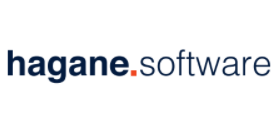

<!-- 

 -->

<a href="https://www.facebook.com/haganesoftware/">

	
	<!--  -->
	
	
</a>

<!-- 

 -->

## Introducción
**Desarrollo de sistema de control de avances de proyectos para clientes registrados en ambiente web.**

Como dice el texto anterior este es un proyecto de prácticas para la empresa Hagane Software localizado en Monterrey, Nuevo León.
- [Página en Facebook](https://www.facebook.com/haganesoftware/).

Este es un sistema desarrollado en ambiente web el control de avances de proyectos para clientes, en el que este le permitirá administrar la información como:para solucionar el problema de organización de elementos en la empresa como:
- Empresas.
- Clientes.
- Proyectos.
- Contacto con el cliente.
- Recordatorio de eventos.
- entre otras funciones.

## Framework
El framework para el desarrollo de este es Laravel, desarrollado en el lenguaje de programación PHP.

	
	

## Base de datos
La base de datos a utilizar es PostgreSQL.
En el que dentro de esta base se manejará de manera local para pruebas y muy probablemente para la versión de entrega. 

<!-- ## About Laravel

Laravel is a web application framework with expressive, elegant syntax. We believe development must be an enjoyable and creative experience to be truly fulfilling. Laravel attempts to take the pain out of development by easing common tasks used in the majority of web projects, such as:

- [Simple, fast routing engine](https://laravel.com/docs/routing).
- [Powerful dependency injection container](https://laravel.com/docs/container).
- Multiple back-ends for [session](https://laravel.com/docs/session) and [cache](https://laravel.com/docs/cache) storage.
- Expressive, intuitive [database ORM](https://laravel.com/docs/eloquent).
- Database agnostic [schema migrations](https://laravel.com/docs/migrations).
- [Robust background job processing](https://laravel.com/docs/queues).
- [Real-time event broadcasting](https://laravel.com/docs/broadcasting).

Laravel is accessible, yet powerful, providing tools needed for large, robust applications. A superb combination of simplicity, elegance, and innovation give you tools you need to build any application with which you are tasked.

## Learning Laravel

Laravel has the most extensive and thorough documentation and video tutorial library of any modern web application framework. The [Laravel documentation](https://laravel.com/docs) is thorough, complete, and makes it a breeze to get started learning the framework.

If you're not in the mood to read, [Laracasts](https://laracasts.com) contains over 900 video tutorials on a range of topics including Laravel, modern PHP, unit testing, JavaScript, and more. Boost the skill level of yourself and your entire team by digging into our comprehensive video library.

## Laravel Sponsors

We would like to extend our thanks to the following sponsors for helping fund on-going Laravel development. If you are interested in becoming a sponsor, please visit the Laravel [Patreon page](http://patreon.com/taylorotwell):

- **[Vehikl](http://vehikl.com)**
- **[Tighten Co.](https://tighten.co)**
- **[British Software Development](https://www.britishsoftware.co)**
- **[Styde](https://styde.net)**
- [Fragrantica](https://www.fragrantica.com)
- [SOFTonSOFA](https://softonsofa.com/)

## Contributing

Thank you for considering contributing to the Laravel framework! The contribution guide can be found in the [Laravel documentation](http://laravel.com/docs/contributions).

## Security Vulnerabilities

If you discover a security vulnerability within Laravel, please send an e-mail to Taylor Otwell at taylor@laravel.com. All security vulnerabilities will be promptly addressed.

## License

The Laravel framework is open-sourced software licensed under the [MIT license](http://opensource.org/licenses/MIT).
#hagane
# hagane -->
